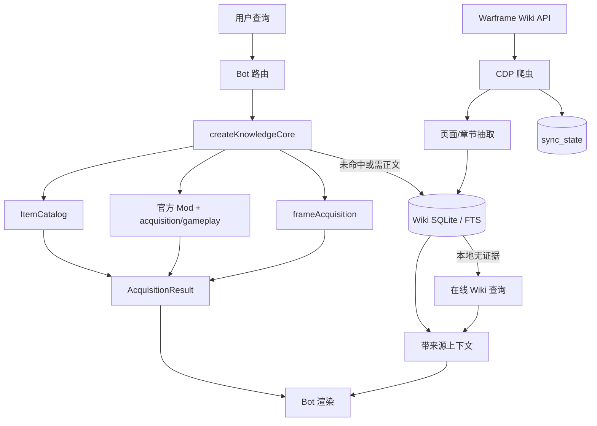

# Warframe Knowledge Core 架构

本文描述仓库当前实际实现。字段级契约见 [REFERENCE.md](REFERENCE.md)。

## 边界与统一模型

核心目标是让 Bot、网页和其他消费端共享同一套静态事实、实体 ID、名称解析和获取结果。仓库不保存 Market 挂单、世界状态等实时快照；这类数据由消费端实时查询。

当前统一入口是 `createKnowledgeCore()`。它加载审核知识、官方 Mod 目录、统一 `ItemCatalog`、实体 registry，并暴露查询与 DTO 构造器：

- **ItemCatalog**：`generated/official-items.json`，从 `warframe-items` 的 Resources、Gear、Misc、Arcanes 生成；每个物品以 `uniqueName` 为稳定主键，统一描述、掉落、配方、材料及配方变体。
- **AcquisitionEvidence**：一条可审计获取证据，携带证据类型、来源、实体引用、概率、数量和核验状态。
- **AcquisitionResult**：一次物品获取查询的统一结果，包含物品、证据、配方变体、状态和说明。
- **RenderResult**：展示层统一返回容器，包含文本、获取结果、分段和警告。

三个 DTO 由 `src/acquisition-dto.js` 创建并递归冻结。消费端应通过构造器创建对象，不应修改返回值。

## 数据分层与所有权

- `facts/`：带来源的基础事实与名称映射。
- `knowledge/`：人工或生成的加工知识；`module=acquisition` 表示刷取对象，`module=gameplay` 表示可复用玩法。
- `categories/`：人工语义分类；`categories/official.json` 是官方 Mod 生成快照。
- `entities/`：地点、商人和货币 registry，使用稳定 ID 建立跨数据引用。
- `generated/`：从锁定依赖或官方导出生成的目录、来源元数据、战甲和遗物数据。
- `cache/`：战甲配方与奖励导出的运行缓存，不是公共知识源。
- `dist/`：仅含已审核知识及生成目录的发布产物，并带 manifest 与 SHA-256。
- QQ Bot 的 Wiki SQLite：由 `qq-bot` 爬虫维护的派生证据库，不属于本包的发布数据，也不由核心直接加载。

`createKnowledgeCore({ approvedOnly: true })` 默认只把 `reviewStatus=approved` 的 facts/knowledge 放入公开搜索。为读取 Mod 提示，内部另加载未过滤知识，但仅由 `getModTips()` 和 `getModTipKeywords()` 按精确对象使用。

## ItemCatalog 与实体 registry

`sync-official-items.js` 对四个上游文件执行允许列表和显式排除策略，按 `uniqueName` 去重并生成 ItemCatalog。`description.display` 优先使用官方简中本地化，否则回退英文；`localizationStatus` 明示该状态。掉落与配方来自锁定版本 `warframe-items`，不会推测缺失值。

配方材料仍使用上游 `uniqueName`，因为并非每个材料都一定进入 ItemCatalog。引用时先按 ItemCatalog `uniqueName` 解析；未命中时保留上游路径和 canonical 文本，不应伪造本地实体。

`locations`、`vendors`、`currencies` registry 加载后递归冻结，分别暴露 `values/get/search`。registry 的 `id` 是跨对象引用主键；`canonical`、`displayName`、`aliases` 只用于查找和展示。父地点使用 `parentId`，商人所在地使用 `locationId`，证据使用 `locationId/vendorId/currencyId`。

## 获取查询的优先级与降级

`resolveItem()` 的当前顺序是：

1. ItemCatalog 精确匹配：`uniqueName`、`canonical`、`displayName` 或配方变体 alias。
2. 官方 Mod 精确匹配。
3. 战甲兼容解析器精确匹配。
4. ItemCatalog 模糊搜索；唯一候选即返回，多候选返回 `ambiguous`。
5. 无候选返回 `null`。

`getItemAcquisition()` 在上述解析结果上构造 `AcquisitionResult`：

- ItemCatalog：掉落转为 `type=drop` 证据，配方转为 `type=recipe` 证据；若命中的配方变体标记 `pendingWikiEvidence`，不会把普通配方误当成该变体证据，并把变体说明放入 `notes`。
- Mod：兼容调用原有 `getAcquisition()`，命中本地刷取知识时产生 `type=knowledge` 证据；没有本地刷取知识也保持官方 Mod 已解析状态。
- 战甲：产生 `type=warframe` 证据，详细部件、遗物和材料仍由 `frameAcquisition` 适配层提供。
- 歧义：`status=ambiguous`，候选展示名写入 `notes`。
- 未命中：`status=not-found`。

这套顺序保证新 ItemCatalog 优先，同时保留现有 Mod/战甲调用方。它并不把 Mod 或战甲强行改造成 ItemCatalog item；`AcquisitionResult.item` 因此是兼容联合类型，调用方应结合解析结果的 `kind` 或对象字段判断。

## Mod 与战甲兼容适配

Mod 仍由 `categories/official.json` 提供官方目录，并由 `knowledge/acquisition` 提供审核刷法。统一名称解析器会把官方 Mod 名称候选补入 alias resolver；`getAcquisition()` 再按 `subject.canonical` 精确关联知识条目，并通过 `methodRefs` 展开 gameplay。分类默认玩法只在条目未显式提供 `methodRefs` 时继承。

战甲适配位于 `src/frame-acquisition.js`。它合并 `warframe-items`、官方 Public Export 生成文件、少量显式审计覆盖及实体地点翻译。普通战甲返回部件来源和制造材料；Prime 战甲根据官方生成遗物、任务奖励活动状态和可选 Varzia manifest 判断“当前出库 / Prime 重生 / 已入库”。网络加载先用新鲜缓存，失败时回退旧缓存；网络和缓存均不可用才抛错。`WF_EXPORT_CACHE_DIR` 可改变默认缓存目录。

## Wiki SQLite 证据库

QQ Bot 的 `systems/warframe_wiki_sync.js` 通过独立 Chrome CDP 会话访问 MediaWiki API，抽取页面、章节、别名和分类，写入 SQLCipher/SQLite。存储包含 `pages`、`sections`、`aliases`、`categories`、`recent_changes`、`sync_state` 及页面/章节 FTS5 索引。

它是详细正文证据和核心未命中时的补充层，不是 ItemCatalog 的隐式覆盖源。Wiki 中尚未被结构化接入的证据必须保持“待证据”状态；例如 100x Cipher 只存在变体解析和 `pendingWikiEvidence`，当前核心不会从 SQLite 自动补材料。

同步器支持 full 和 incremental：全量按 `allpages` 分页并保存 continuation/cursor；增量按 `recentchanges` 保存时间戳和 cursor。`.sync.lock` 防止并行任务，状态写入 `sync_state`。已确认的环境变量、状态键、字段和计划任务见 REFERENCE。

## Bot 与爬虫数据流

共享核心加载失败时，Bot 可按自身旧实现降级；Wiki 本地索引未命中时可查询在线 Wiki。架构要求降级结果显式保留来源和警告，不把缺失证据包装成确定事实。

## 名称、ID 与引用规则

- 官方物品主键：`/Lotus/...` `uniqueName`；canonical/displayName/variant aliases 用于解析。
- 知识主键：全仓唯一 `entry.id`；玩法 ID 使用 `gameplay.<slug>`。
- `methodRefs`：只引用 gameplay entry ID；显式引用优先于分类 `defaultMethodRefs`。
- 分类引用：`subject.categoryRefs[]` 引用 category `id`，第一项也是描述模板的主分类。
- 实体引用：只能保存 registry `id`；展示名和别名不得作为外键。
- 配方引用：`recipeVariant.recipeId` 引用同一 item 的 recipe `id`；`null` 表示当前无结构化配方证据。

## 来源优先级

1. 锁定版本官方 Public Export / 官方掉落表及其生成来源元数据。
2. 官方简中本地化；缺失时保留英文并标记 fallback。
3. 经审核的 facts/knowledge 与显式人工审计覆盖。
4. Wiki SQLite 中带 revision/timestamp 的正文证据。
5. 在线 Wiki 临时查询。
6. 旧缓存或消费端兼容资料。

较低优先级只能补缺，不能静默覆盖较高优先级的稳定 ID 或已核验结构化值。实时轮换状态可比静态快照更新，但必须与静态身份、配方数据分开处理。

## 构建、校验与发布

`npm run validate` 校验 schema、ID 和引用；`npm test` 执行回归测试；`npm run build` 仅发布 approved facts/knowledge，并将生成目录和实体 registry 写入 `dist/`。`manifest.json` 记录数量、来源及每个文件的 SHA-256。

上游发生变化时使用 `npm run maintain` 完整同步；只检查漂移使用 `npm run check:all`。脚本和参数见 REFERENCE。
