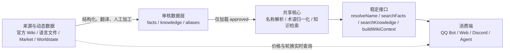
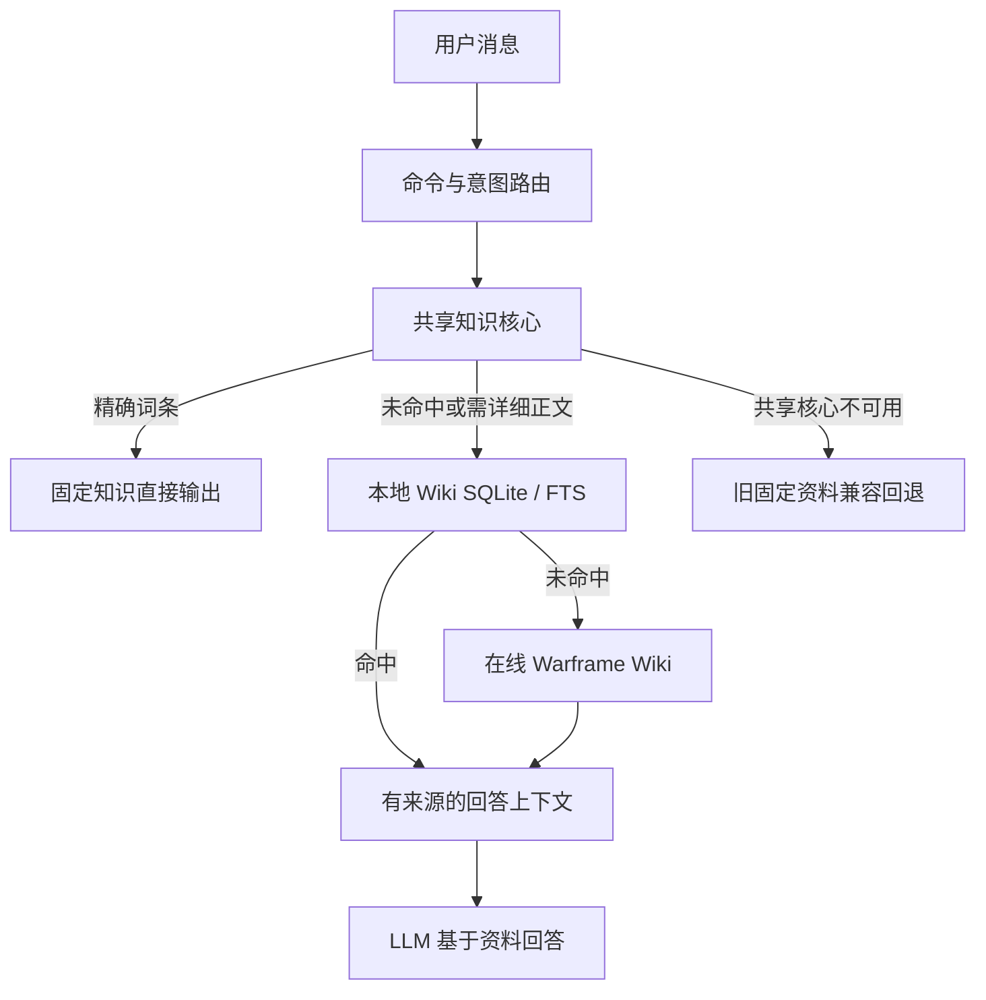
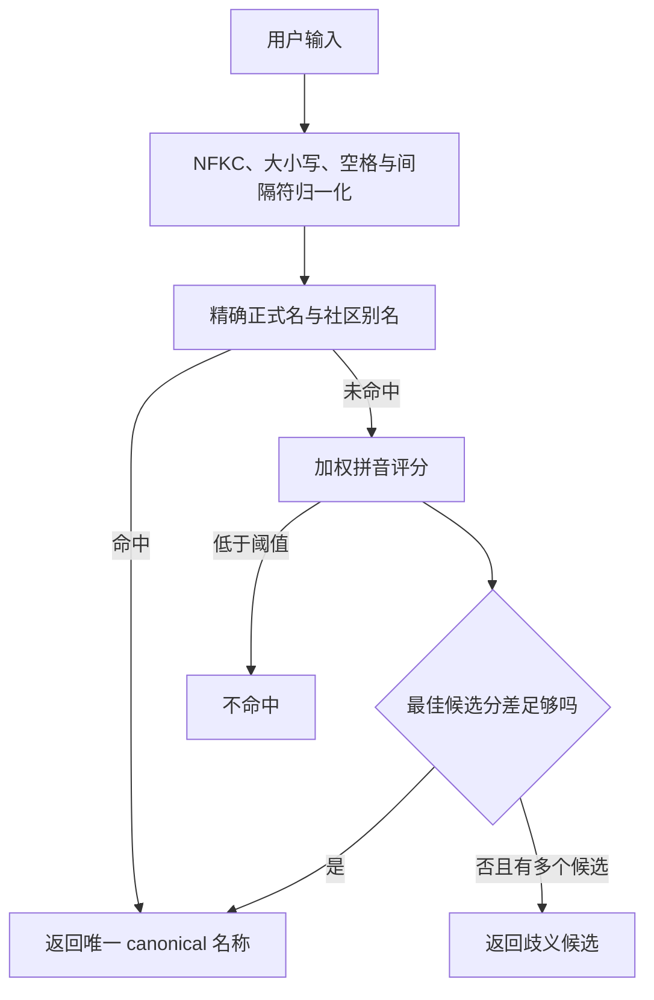
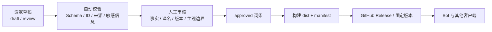

# Warframe 共享知识核心架构

当前目标是“一套数据、一套解析、多端复用”。知识数据、公共接口和名称解析入口已经统一：QQ Bot 的 Market、Wiki、赏金与紫卡都通过共享核心的 `resolveName()` 解析名称；实时数据仍由各业务模块按需获取。

## 总体分层

核心边界：静态事实和二次知识进入 GitHub；挂单、价格、赏金、裂缝和轮换不固化到仓库，由消费端实时请求。

## QQ Bot 当前查询链路

Bot 接入点位于 `qq-bot/bot.js` 的 `wfSharedCore` 与 `matchWarframeReference()`。共享核心加载失败时会回退旧资料，避免线上功能中断。

## 名称解析链路

本地完整版加权维度包括：最长公共子序列、查询覆盖率、候选覆盖率、开头连续匹配、最长连续片段、缺失音节惩罚和额外音节惩罚。

## 数据所有权

| 资产 | 内容 | 维护方式 | 性质 |
|---|---|---|---|
| `facts/` | 官方译名、机制事实、必要摘录 | GitHub PR + 人工审核 | 静态 |
| `knowledge/` | 萌新答疑、黑话、攻略、评级 | GitHub PR + 人工审核 | 静态 |
| `facts/aliases.json` | 战甲别称、固定映射、术语修正 | 回归测试保护 | 静态 |
| Market / Worldstate | 挂单、价格、裂缝、赏金轮换 | 消费端实时 API | 动态 |
| Wiki SQLite | 页面和章节全文索引 | 同步器构建、Release 发布 | 派生 |
| Bot 配置与缓存 | 密钥、QQ 绑定、群号、运行状态 | 仅部署环境 | 私有 |

## 审核与发布流水线

CI 流程：`npm ci` → `npm run validate` → `npm test` → `npm run build`。

## 当前完成度

- 基础事实：3 条。
- 加工知识：6 条。
- 本地回归测试：8/8 通过。
- QQ Bot：Market、Wiki、赏金和紫卡已统一接入 `resolveWarframeName()` → 共享核心 `resolveName()`。
- GitHub：公开仓库、Schema、CI 和 Release 工作流已建立。
- 动态 API：继续由 Bot 实时请求，没有写入知识库。

## 当前风险

### 1. 历史解析代码尚待物理清理

运行时名称解析已经收口到共享核心。`bot.js` 中仍保留一段不可达的旧 WFM 评分实现，作为本次迁移后的短期对照；它不会参与运行，待线上回归稳定后可以直接删除。翻译输出表与实时 API 适配属于业务展示和数据获取，不再承担名称消歧。

### 2. 本地与 GitHub 版本可能漂移

Bot 当前使用部署目录中的复制版本，而不是锁定 Git tag、Release 或 npm 版本。手动复制会造成“本地完整版、GitHub 版、VPS 版”出现差异。

### 3. 审核身份需要规范化

首批条目的 `reviewedBy` 使用本地标识 `12407`。公开协作后应改为 GitHub 用户名；主观攻略最好要求两名维护者复核。

### 4. 事实时效需要更精确

`gameVersion: current` 方便但不可审计。高风险机制应保存明确版本、上游页面 revision 和最后验证日期。

## 后续优先级

### P0：建立唯一发布版本

- GitHub 成为唯一可信源码。
- Bot 锁定 Git tag、Release 或包版本。
- 部署时校验 `manifest.json` 和 SHA-256。
- 禁止继续手动复制未经标记的核心目录。

### P1：清理迁移遗留并扩大回归集

- 删除 `bot.js` 中已经不可达的旧 WFM 评分实现。
- 继续把仅用于翻译展示的映射与名称解析数据明确分离。
- 将所有历史错误查询加入共享回归测试。

### P2：Wiki 大索引产品化

- 同步器在受控环境生成 SQLite/JSONL。
- 作为 GitHub Release 派生产物发布，不进入 Git 历史。
- 消费端按版本下载，并在同步失败时继续使用旧索引。

## 总评

方向正确：事实与加工知识分层、人工审核、动态 API 隔离和统一解析入口都已落地。当前名称解析已完成运行时收口；剩余重点是删除迁移遗留、扩大回归集，并让 Bot 锁定 GitHub Release 或包版本以消除部署副本漂移。
